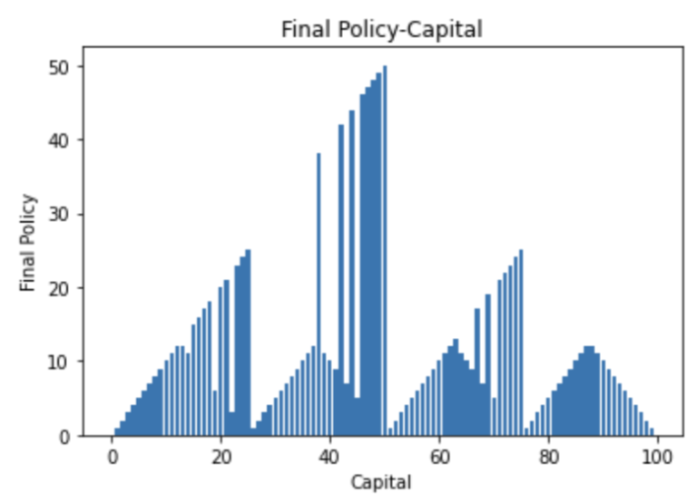

# Model-Based Reinforcement Learning

In this project, we model a lottery festival scenario where an individual bets on a sequence of coin tosses. If the coin lands heads, they win an amount equal to their bet. If it lands tails, they lose the same amount. The process continues until they either achieve their goal of winning $100 or lose all their money.

## Problem Modeling

**Key Aspects:**
- **Probability of Heads**: Denoted by `𝑝h`.
- **States**: The gambler’s capital, `s ∈ {1, 2, ..., 99}`.
- **Actions**: The stakes, `a ∈ {0, 1, ..., min(s, 100 − s)}`.
- **Rewards**: Zero on all transitions except those where the gambler reaches their goal, which is +1.
- **Discount Factor**: Since this is a Markov chain without discounting, `gamma = 1`.

We design an agent using the **Value Iteration** algorithm to determine the optimal betting strategy at each step, applying the Bellman equation. 

## Results

We generate plots for two different values of `𝑝h`: `𝑝h = 0.25` and `𝑝h = 0.55`.

**Results for 𝑝h = 0.25:**

- **Optimal Policy per Capital:**

  

- **Value Function per Capital:**

  

**Results for 𝑝h = 0.55:**

- **Optimal Policy per Capital:**

  

- **Value Function per Capital:**

  

For a better understanding, we visualize the results with the above plots.
